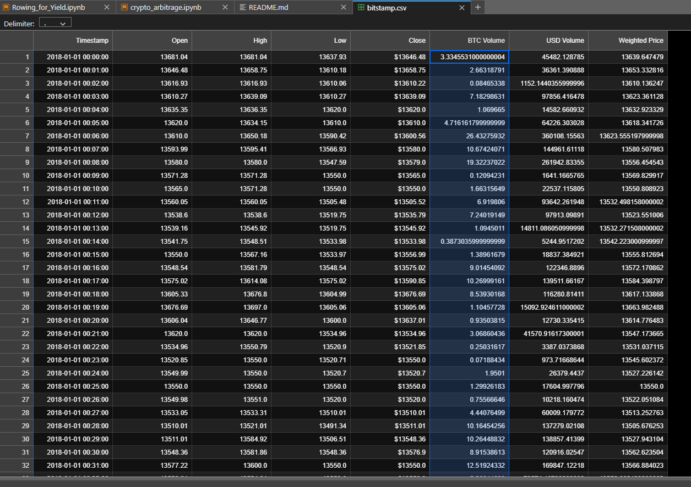

# Crypto Arbitrage

Hello, this project is considering arbitrage opportunities in Bitcoin and other cryptocurrencies. Using Pandas as main package to run and test sequences.

---

## Technologies

pandas is a software library written for the Python programming language for data manipulation and analysis. In particular, it offers data structures and operations for manipulating numerical tables and time series.

---

## Installation Guide

The installation process is very simple. Import pandas.

import pandas as pd
from pathlib import Path
%matplotlib inline

Then connect the pathway.

bitstamp = pd.read_csv("Resources/bitstamp.csv",
    index_col='Timestamp',
    parse_dates=True,
    infer_datetime_format=True
)

This is the CSV needed.

---

## Usage

---

## Contributors

-Name: John Nguyen
-Email: nguyenjohn1337@gmail.com

---

## License

When you share a project on a repository, especially a public one, it's important to choose the right license to specify what others can and can't with your source code and files. Use this section to include the license you want to use.

Specify the details of your project’s license - that is, how others can or cannot use your code and files.
